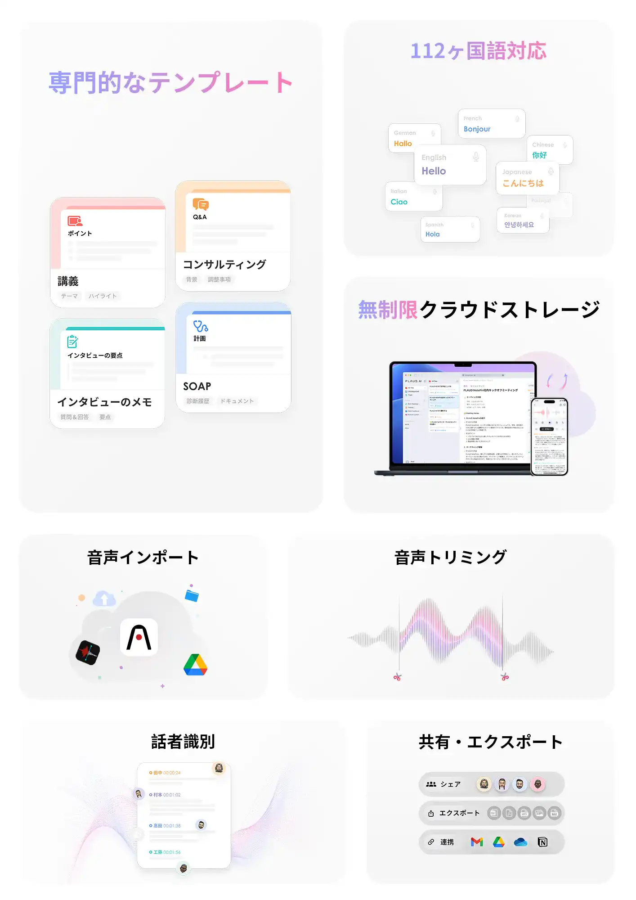

## 会議の記録と共有における「非効率」を解消する

会議後の議事録作成に費やされる時間。 言った言わないの確認作業によるタイムロス。  
PLAUD NOTE（プラウドノート）は、これらを技術的に解決するために設計されたAIボイスレコーダーです。

  

    

      
Before

      

        
会議後、記憶やメモを頼りに議事録を作成。 録音データの聞き返し・書き起こし作業が別途発生。

      

    

    

      <i class="fa-solid fa-circle-arrow-down" aria-hidden="true"></i>
      <i class="fa-solid fa-circle-arrow-right" aria-hidden="true"></i>
    

    

      
After

      

        
会議終了直後に「決定事項」「ToDoリスト」「重要発言」を自動抽出。 確認と微修正だけで共有できる。

      

    

  

毎月300分の文字起こしが無料。まず公式サイトで仕様を確認してみてください。