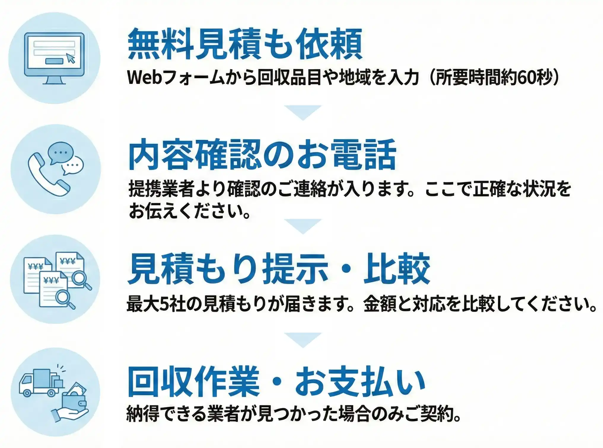

## なぜ、不用品回収トラブルが後を絶たないのか。

「最初は安いと言われたのに、積み込み後に高額請求された」

「無料回収と聞いていたのに、手数料を取られた」

国民生活センターに寄せられる不用品回収の相談件数は高止まりしています。
最大の原因は、「依頼者が適正な相場を知らないこと」につけ込む一部の悪質業者の存在です。

1社だけの見積もりで即決することは、相場より数万円〜数十万円高く支払ってしまう可能性があります。

## 「比較」こそが、賢い防衛策。

適正価格で、安全に片付けるための正攻法。
それは「複数社の見積もりを比較すること」です。

*全国対応*の不用品回収・遺品整理一括見積もりサービス「ぽいみつ」なら、あなたの条件に合う最大5社の見積もりを一度に取り寄せることができます。

  <a href="/link/poimitsu/" class="text-primary font-bold underline underline-offset-4 decoration-primary/40 hover:decoration-primary transition-all">
    >> お住まいの地域の相場を確認する（無料）
  </a>

## 安さだけではない。「信頼」をフィルタリングする仕組み。

本サービスは単なる価格比較サイトではありません。
安心してご利用いただくために、あえて「アナログな確認工程」を設けています。

  

    <h3 class="text-xl font-bold text-slate-900 mb-0 !mt-3 !border-0 !pb-0 !pl-0">1. 厳格な加盟店審査</h3>
    

      不法投棄や不当請求を行う業者は提携をお断りしています。古物商許可や廃棄物収集運搬許可など、適切な許認可を持つ優良業者のみと提携しています。
    

  

  

    <h3 class="text-xl font-bold text-slate-900 mb-0 !mt-3 !border-0 !pb-0 !pl-0">2. 電話による本人確認と詳細ヒアリング</h3>
    

      Webフォーム送信後、提携業者またはサポートセンターよりお電話にて内容の確認を行わせていただきます。
    

    

      「Webだけで完結しない」のには理由があります。 
      回収量や搬出経路（階段の有無など）を電話で正確にヒアリングすることで、「当日になって追加料金が発生する」というトラブルのリスクを減らすためです。
    

  

  

    <h3 class="text-xl font-bold text-slate-900 mb-0 !mt-3 !border-0 !pb-0 !pl-0">3. ゴミ屋敷・遺品整理・空き家にも対応</h3>
    

      一般的な不用品回収だけでなく、専門的な知識を要する遺品整理や、大規模なゴミ屋敷清掃、空き家の残置物撤去まで対応可能です。
    

  

  <a href="/link/poimitsu/" class="text-primary font-bold underline underline-offset-4 decoration-primary/40 hover:decoration-primary transition-all">
    >> 信頼できる業者の見積もりを取り寄せる
  </a>

## ご利用の流れ

## 片付かない部屋の悩み、今日で終わりにしませんか？

「いつか片付けよう」と先延ばしにしている間に、ゴミや不用品は生活スペースを圧迫し続けます。

まずは「いくらかかるのか」を知ることから始めてください。
相場を知ることは、あなた自身を守ることです。